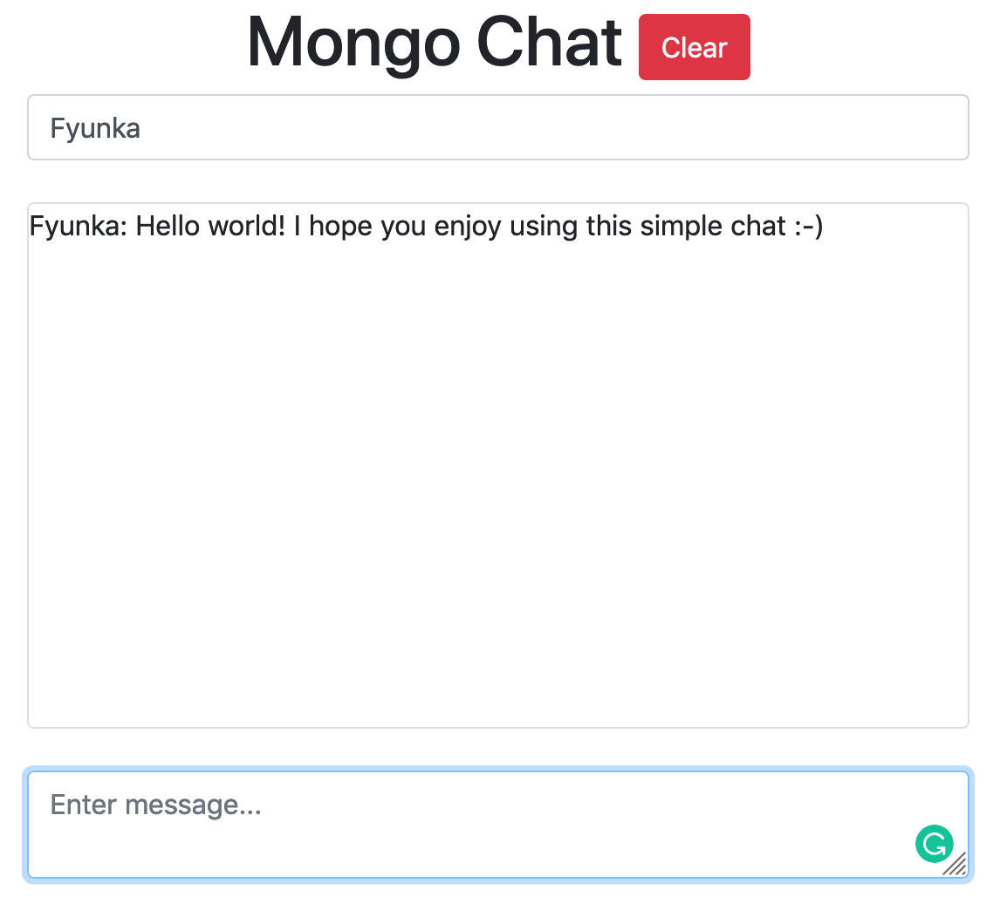
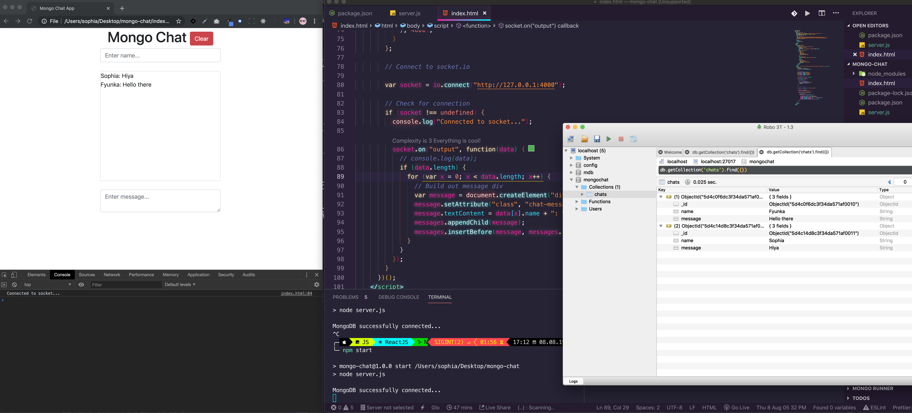

# Node.js Chat App with MongoDB & Socket.io

   

### Simple Node.js chat application that uses a MongoDB database to store messages and Socket.io for bi-directional communication. Although this is a simple app, the code is a bit advanced but I do try and explain things the best I can thru comments left in the code. 

## Installation

In the project directory, you need to download the following dependencies into your package.json file:

### `npm install mongodb@^2.2.36 socket.io --save`

Then run:

### `npm start`

Make sure that you have the following script placed within your package.json file to run thru *npm start* command line:

` "scripts": {
    "start": "node server.js"
  }
  `

Runs the app in the development mode.

Open [http://localhost:4000](http://localhost:4000) to view it in the browser.

## Learn More

You can learn more in the [Realtime application framework (Node.JS server)](https://github.com/socketio/socket.io)

You can learn more in the [Mongo DB Native NodeJS Driver](https://github.com/mongodb/node-mongodb-native)

## Applications

Download Robomongo [Robo 3T](https://robomongo.org/)

